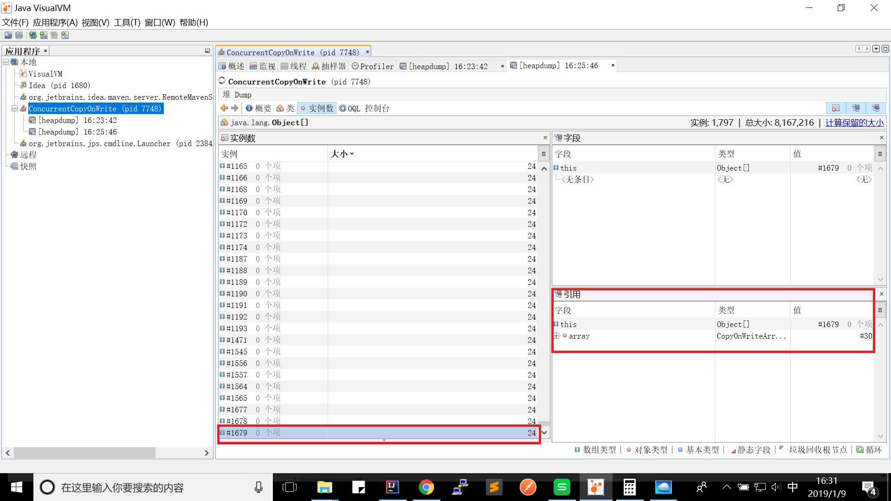

## 背景

团队遇到一次内存溢出的性能问题，解决这个问题的同时，我们观察到Javadump(OpenJ9)中有多个线程都在使用CopyOnWriteArrayList的add方法

    3XMTHREADINFO      "dw-378 - GET /api/res/v1/subnetworks/06670f87-1e4f-49df-9910-858028199616/fddv3.eutrancellfdds?includeAttr=userLabel,nbiIdDn&queryDn=true" J9VMThread:0x00000000013A0B00, omrthread_t:0x00007F3578004468, java/lang/Thread:0x000000078255C300, state:R, prio=5
    3XMJAVALTHREAD            (java/lang/Thread getId:0x17A, isDaemon:false)
    3XMTHREADINFO1            (native thread ID:0x190, native priority:0x5, native policy:UNKNOWN, vmstate:CW, vm thread flags:0x00001001)
    3XMTHREADINFO2            (native stack address range from:0x00007F36E645F000, to:0x00007F36E649F000, size:0x40000)
    3XMCPUTIME               CPU usage total: 1.016090595 secs, current category="Application"
    3XMHEAPALLOC             Heap bytes allocated since last GC cycle=0 (0x0)
    3XMTHREADINFO3           Java callstack:
    4XESTACKTRACE                at java/util/Arrays.copyOf(Arrays.java:3210(Compiled Code))
    4XESTACKTRACE                at java/util/Arrays.copyOf(Arrays.java:3181(Compiled Code))
    4XESTACKTRACE                at java/util/concurrent/CopyOnWriteArrayList.add(CopyOnWriteArrayList.java:440(Compiled Code))
    4XESTACKTRACE                at com/zte/ums/em/rm/cache/RmTreeCache.recursiveSubtree2Locations(RmTreeCache.java:453(Compiled Code))
    4XESTACKTRACE                at com/zte/ums/em/rm/cache/RmTreeCache.recursiveSubtree2Locations(RmTreeCache.java:454(Compiled Code))
    4XESTACKTRACE                at com/zte/ums/em/rm/cache/RmTreeCache.recursiveSubtree2Locations(RmTreeCache.java:454(Compiled Code))
    4XESTACKTRACE                at com/zte/ums/em/rm/cache/RmTreeCache.subtree2Locations(RmTreeCache.java:366(Compiled Code))
    4XESTACKTRACE                at com/zte/ums/em/rm/service/RmService.getDescendantsRid(RmService.java:914(Compiled Code))
    4XESTACKTRACE                at com/zte/ums/em/rm/api/RmApi.getCommChildrenInResp(RmApi.java:1459(Compiled Code))
    4XESTACKTRACE                at com/zte/ums/em/rm/api/RmApi.getChildrenInResp(RmApi.java:1416(Compiled Code))
    4XESTACKTRACE                at com/zte/ums/em/rm/resources/BasicResource.getChildrenEnt(BasicResource.java:298(Compiled Code))
    4XESTACKTRACE                at com/zte/ums/em/rm/resources/RmResource.getChildren(RmResource.java:351(Compiled Code))

CopyOnWriteList的核心存储是Object[]

        private transient volatile Object[] array;    

CopyOnWriteList的add方法简明易懂。获取旧数组(Object[])，复制到一个新数组，新数组元素数量多1个，将新增元素放到新数组上，将CopyOnWriteList
的核心存储指向新数组

        public boolean add(E e) {
            final ReentrantLock lock = this.lock;
            lock.lock();
            try {
                Object[] elements = getArray();
                int len = elements.length;
                Object[] newElements = Arrays.copyOf(elements, len + 1);
                newElements[len] = e;
                setArray(newElements);
                return true;
            } finally {
                lock.unlock();
            }
        }
        
由这个问题引出了几个疑问
* COW在复制新数组时是复制了对象，还是复制了引用？
* COW在容量较大时，并发读写会有CPU冲高风险吗？
* COW在容量较大时，并发读写会有内存溢出风险吗？

## 实验

核心思路就是制造一个大容量的COW，并发读写
 1.初始化COW容器
 2.一个定时器负责启动读线程，一个定时器负责启动写线程
 3.读定时器调度到时，从线程池申请线程，使用多个线程并发读COW容器。读逻辑是循环最多10000个元素
 4.写定时器调度到时，从线程池申请线程，使用多个线程并发写COW容器。写逻辑是增加1个元素，由于有并发读，因此会导致COW
 5.整体采用倒计时闩锁控制应用的结束
 6.倒计时结束后，关闭线程池
 
 [实验代码](https://github.com/wenger66/java-lab/tree/master/cow)
 
 ## 结论
 
 * COW在写时的复制，新数组引用了老数组中元素，并没有拷贝元素
 
 通过jvisualvm多次观察内存dump的快照，如下图1，每次都只有一个大数据量的Object[]；如下图2，还有一些空的父亲是
 CopyOnWriteList的Object[], 这些对象就是往COW新增元素留下的还没有被GC回收的旧数组，他们只有占用很小的自身大小的内存，而且很容易被回收

 

* COW在容量较大时，一般没有CPU冲高和内存溢出的风险

图3的测试场景是COW容量100万，每隔1秒8个线程读，2个线程写，Java堆设置-Xmx1G。无明显CPU冲高，内存溢出现象

图4的测试场景是COW容量100万，每隔1秒16个线程读，4个线程写，Java堆设置-Xmx1G。无明显CPU冲高，内存溢出现象

既然 CopyOnWriteList 没有性能问题，那么为什么我们的Javadump中有那么多线程在使用CopyOnWriteList 的add方法
如果多个线程堆栈，总是停留在某个方法，说明这个方法还是值得关注的

初始化一个CopyOnWriteList，代码很简单，循环向容器add

        private static void initialize() {
            long start = System.currentTimeMillis();
            for(int i=0;i< TEST_OBJECT_SIZE; i++) {
                cache.add(new Element());
            }
            long end = System.currentTimeMillis();
            System.out.println("success to initialize, use "+(end-start)+" ms ");
        }
        
得到以下数据

初始化1万元素，-Xmx1G，瞬间加载结束。
success to initialize, use 421 ms

初始化10万元素，-Xmx1G，加载也很快。
success to initialize, use 4092 ms

初始化100万元素，-Xmx1G 速度非常慢，耗时7分10秒，而且CPU冲高。

初始化100万元素， -Xmx2G -Xms1G，速度没有改观，耗时6分50秒，CPU还是不低

再加大内存，初始化100万元素，-Xmx3G -Xms2G，速度还变多了，CPU不低

再结合我们线程栈指向的代码，我们在**局部变量**中使用了CopyOnWriteList。
一个List临时存储数据，肯定和上面的初始化代码一样要大量调用List的add方法

所以有了第3条结论
* 局部不要使用CopyOnWriteList，大才小用了，而且循环向CopyOnWriteList中add会不断复制数组(单线程百万级循环)，可能会导致CPU冲高。
全局如果要考虑并发问题，完全可以使用CopyOnWriteList

如果一定要在局部使用CopyOnWriteList，该如何初始化，如下即可
    
    private static void initialize2() {
        long start = System.currentTimeMillis();
        List<Element> elements = new ArrayList<Element>();
        for(int i=0;i< TEST_OBJECT_SIZE; i++) {
            elements.add(new Element());
        }
        long end = System.currentTimeMillis();
        System.out.println("success to add arraylist, use "+(end-start)+" ms ");
        cache.addAll(elements);
        end = System.currentTimeMillis();
        System.out.println("success to initialize, use "+(end-start)+" ms ");
    }
    
*尽量使用COW的addAll方法，少用add方法

