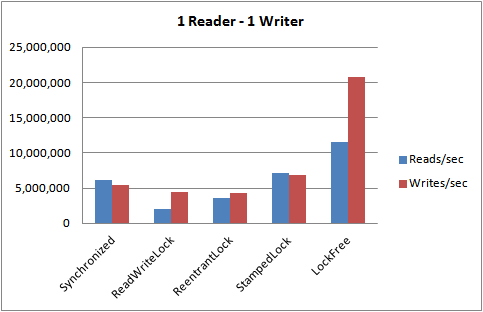

## 源码
这个实验的原作者是Martin Thompson，我只是做了部分注释。Martin Thompson是Java Champion称号获得者,同时也是一名高性能计算科学家

测试用例是设计一个可在两维空间中移动其位置的太空船，其位置的坐标可以原子性的读取

    /**
     * 太空船可以在二维空间移动位置，可以更新和读取当前位置的并发接口
     */
    interface Spaceship
    {
        /**
         * 读取太空船的位置
         *
         * @param coordinates 保存读取到的xy坐标
         * @return 读取坐标尝试的次数
         */
        int readPosition(final int[] coordinates);
    
        /**
         * xy表示移动太空船的位置
         *
         * @param xDelta x坐标轴上移动的距离
         * @param yDelta y坐标轴上移动的距离
         * @return 写入新的坐标尝试的次数
         */
        int move(final int xDelta, final int yDelta);
    }

为每个飞船设置了多个实现，包括LockFree、ReentrantLock、ReadWriteLock、StampedLock、Synchronized。每种实现运行5次求平均值

       // 运行5次，求平均值
        for (int i = 0; i < 5; i++)
        {
            System.out.println("*** Run - " + i);
            for (final Spaceship spaceship : SPACESHIPS)
            {
                System.gc();
                Thread.sleep(TEST_COOL_OFF_MS);
    
                perfRun(spaceship);
            }
        }

该测试程序有3个入参：读线程数、写线程数、读写逻辑运行的时间

     NUM_READERS = Integer.parseInt(args[0]);
     NUM_WRITERS = Integer.parseInt(args[1]);
     TEST_DURATION_MS = Long.parseLong(args[2]);

为了让读写同时开始从而产生并发，引入了关卡；为了让主程序在读写逻辑运行完正常结束，尤其是关闭Executors，引入了倒计时闩锁

            // 开始关卡，给定数量的线程集中的关卡点，Barrier等待的是线程，Latch等待的是事件
            final CyclicBarrier startBarrier = new CyclicBarrier(NUM_READERS + NUM_WRITERS + 1);
            // 结束闩锁，每个线程处理完就CountDown
            final CountDownLatch finishLatch = new CountDownLatch(NUM_READERS + NUM_WRITERS);
            // 统一的结束无限循环的标记，保证每个线程一起可见
            final AtomicBoolean runningFlag = new AtomicBoolean(true);

Results对象是用来保存运行结果的，包括几个读线程，几个写线程，哪种锁实现，读多少次，写多少次，尝试读多少次，尝试写多少次，读时观察到的改变多少次

    1 readers 1 writers  SynchronizedSpaceship reads=3,735,832:[3735832] moves=4,087,646:[4087646] readAttempts=[3735832] moveAttempts=[4087646] observedMoves=[39602]
    
## 结果

   
## 收获

* StampedLock 对现存的锁实现有巨大的改进，特别是在读线程越来越多的场景下：
* StampedLock有一个复杂的API，对于加锁操作，很容易误用其他方法;
* 当只有2个竞争者的时候，Synchronised是一个很好的通用的锁实现;
* 当线程增长能够预估，ReentrantLock是一个很好的通用的锁实现;
* 选择使用ReentrantReadWriteLock时，必须经过小心的适度的测试 ;所有重大的决定，必须在基于测试数据的基础上做决定;
* 无锁的实现比基于锁的算法有更好短吞吐量;