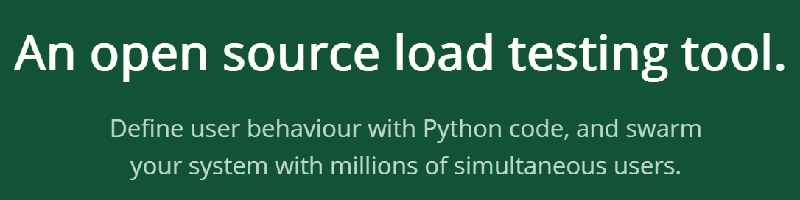
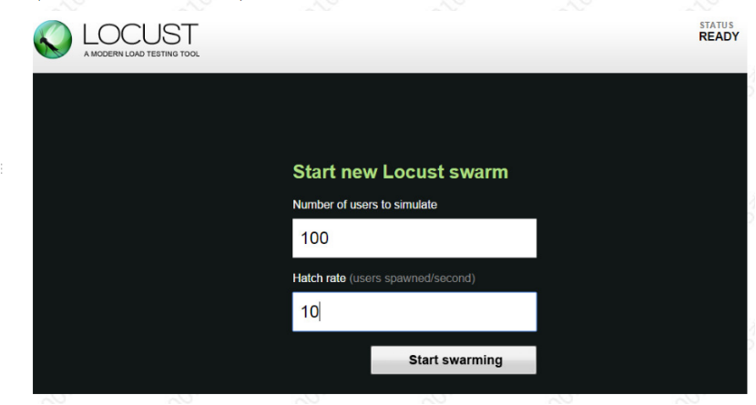
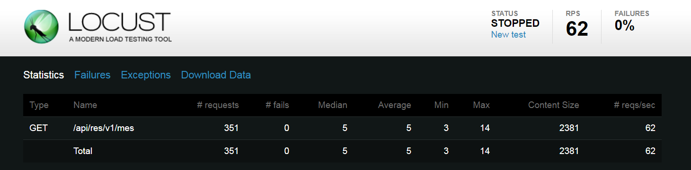
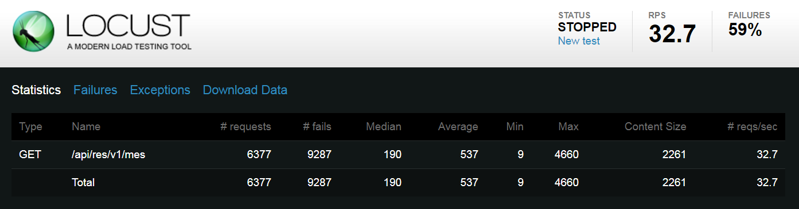

# 初探Locust

## Locust用来解决什么问题

官网：https://locust.io/ 

Locust本意是“蝗虫”，是一个开源的性能测试工具，可以用python语言编写用户行为。就好像成千上万的蝗虫攻击一个庄稼地的情景，Locust就想打造一个模拟成千上万的用户，“攻击”目标web系统的应用场景，所以Locust中多次出现swarm这个词，例如start swarm，意思就是蝗虫一拥而上，开始“攻击”的意思。

同类产品：Loadrunner、JMeter。与Loadrunner相比，Locust优点是免费、简单。关于Locust的优点，大家出门右转，看@王淘的基于loucst的WEB API性能测试实践。Locust其他突出的优点，在原理章节还有描述。

我们团队负责整个公司网管的资源模块，该模块访问频率高、压力大，要求响应速度快，内存占用低，CPU平稳。团队在回顾会上也集体意识到性能测试的重要性，经过初步的研究，决定使用Locust工具，力争解决以下几个问题：

1. 输出资源接口能力

2. 搭建资源接口性能测试框架

3. 模拟高并发测试并解决问题

4. 模拟大数据测试并解决问题

## Locust原理

我在测试方面基本是小白，python也仅仅是入门，所以不敢妄称了解Locust原理，只是根据网上的文章，简单拼凑下我的理解

性能测试工具最核心的模块之一是压力生成器。每个性能测试工具都能模拟1000个用户并发，但实际由于压力生成器实现原理不同，产生的压力也是不同的。LoadRunner和JMeter都是通过线程/进程来模拟用户，也就是说线程数会随着并发用户数的增加而增加，而线程的创建/销毁/切换/调度都是需要占用资源的，这不可避免会导致并发压力的下降。Locust的优势在于其摒弃了进程和线程，完全基于事件驱动，使用gevent提供的非阻塞IO和coroutine来实现网络层的并发请求，因此即使是单台压力机也能产生数千并发请求数。简单说Locust的压力生成器足够强大。

Locust采用Pure Python脚本描述用户行为，尤其是HTTP请求完全基于Requests库，Pythone的Requests库简洁易用，非常强大，思想和模式极其先进。也就是说Locust在测试HTTP请求方面足够强大。

所以虽然看上去Locust的数据统计、分析报告等方面比较简陋，但是其核心引擎足够高大上，所以能吸引到一大批拥趸来使用

## Locust环境

现在已经有团队每晚使用工作机器进行压力测试，因此Locust的环境我们分linux和windows两部分描述

### linux
linux系统下Locust环境的搭建，需要感谢前面同事的努力，镜像让我们省事不少

加载镜像：

    [root@EMS3 ~]#docker load -i locustimg.tar
    
运行镜像：

    [root@EMS3 ~]# docker run -d -p 9089:8089 -it locust:2.0
    a99bc1be4973e93ca1219bb15d3f3d1af9cda7e21a83e59abdcba1bd4b842692
    
为什么要-p 9089:8089，我们后面再说

进入到docker内，查看Locust的版本号，确认Locust安装成功

    # locust --version
    [2018-07-02 03:49:19,026] f6d7b749200b/INFO/stdout: Locust 0.7.5
    
为了以后的便利，我把镜像传到制品库上。在此之前，简单搜了下，公司的镜像仓库上还没有Locust的镜像

    sudo docker login docker.artnj.zte.com.cn
    sudo docker tag locust:2.0 docker.artnj.zte.com.cn/cci/ems/locust:0.7.5
    sudo docker push docker.artnj.zte.com.cn/cci/ems/locust:0.7.5
    
镜像上传到了docker/cci/ems/locust目录，欢迎大家取用

### windows

#### 安装python和pip
    
    注意到locust官网有如下提示：
    Supported Python Versions
    Locust supports Python 2.7, 3.3, 3.4, 3.5, and 3.6.
     
    另外python官网有如下提示：
    pip is already installed if you are using Python 2 >=2.7.9 or Python 3 >=3.4 downloaded from python.org
    
安装pip是另一个疑难课题，因此选择python的2.7.9的64位版本安装

2.7.6的python版本中还有如上图的pip选装，而2.7.9的python版本中已经有了pip的选装

安装python结束，需要设置python的环境变量，增加如下路径

    C:\Python27;C:\Python27\Scripts
    
python根目录下有python的可执行程序，python根目录下的Scripts目录下有pip的可执行程序，后续还有Locust的可执行程序

检查python和pip的安装情况

    C:\Users\10048570>python --version
    Python 2.7.9
    C:\Users\10048570>pip --version
    pip 1.5.6 from C:\Python27\lib\site-packages (python 2.7)
    

#### 安装Locust

python和pip就绪后，就可以安装Locust了，主要参考https://docs.locust.io/en/stable/installation.html#installing-locust-on-windows

    On Windows, running pip install locustio might fail depedning on if you have a build environment set up correctly.
    In that case, the easiest way to get Locust running on windows is to first install the pre built binary package for pyzmq 
    (and possibly for gevent and greenlet as well).
    
    
实际情况确实如上描述，直接pip install locustio，是有莫名其妙的错误，因此先通过whl包安装pyzmq，gevent，greenlet；当然有可能别的环境pip install locustio没有任何问题，可以直接略过下面whl的安装

    http://www.lfd.uci.edu/~gohlke/pythonlibs/
    
如上链接，下载whl包，必须注意，whl包要下对了，否则会遇到“is not a supported wheel”的错误

    C:\Python27\Scripts\pip run on 07/06/18 13:33:12
    pyzmq-16.0.4-cp36-cp36m-win_amd64.whl is not a supported wheel on this platform.
    Exception information:
    Traceback (most recent call last):
    File "C:\Python27\lib\site-packages\pip\basecommand.py", line 122, in main
    status = self.run(options, args)
    File "C:\Python27\lib\site-packages\pip\commands\install.py", line 257, in run
    InstallRequirement.from_line(name, None))
    File "C:\Python27\lib\site-packages\pip\req.py", line 167, in from_line
    raise UnsupportedWheel("%s is not a supported wheel on this platform." % wheel.filename)
    UnsupportedWheel: pyzmq-16.0.4-cp36-cp36m-win_amd64.whl is not a supported wheel on this platform.
    
pyzmq-16.0.4-cp36-cp36m-win_amd64.whl中16.0.4是pyzmq的版本，36表示支持python的3.6版本，win32表示32位版本，win_amd64表示64位版本

另外随python安装的pip，好像版本很低，必须要升级才能安装whl，http://mirrors.zte.com.cn/pypi/simple是公司内网镜像，能访问，库比较全

    D:\>pip install -i http://mirrors.zte.com.cn/pypi/simple --upgrade pip
    http://mirrors.zte.com.cn/pypi/simple/pip/ uses an insecure transport scheme (http). Consider using https if mirrors.zte.com.cn has it available
    Downloading/unpacking pip from http://mirrors.zte.com.cn/pypi/packages/b6/ac/7015eb97dc749283ffdec1c3a88ddb8ae03b8fad0f0e611408f196358da3/pip-9.0.1-py2.py3-none-any.whl#md5=297dbd16ef53bcef0447d245815f5144
    Installing collected packages: pip
    Found existing installation: pip 1.5.6
    Uninstalling pip:
    Successfully uninstalled pip
    Cleaning up...
    
升级后的pip居然是9.x版本，而自带的pip版本居然是1.x，版本号差别如此之大，完全蒙圈，但好在whl可以正常安装了

    D:\>python --version
    Python 2.7.9
    D:\>pip --version
    pip 9.0.1 from C:\Python27\lib\site-packages (python 2.7)
    D:\>pip install pyzmq-16.0.4-cp27-cp27m-win_amd64.whl
    Processing d:\pyzmq-16.0.4-cp27-cp27m-win_amd64.whl
    Installing collected packages: pyzmq
    Successfully installed pyzmq-16.0.4
    
最后安装Locust就很顺利了

    D:\>pip install locustio
    Requirement already satisfied: locustio in c:\python27\lib\site-packages
    Requirement already satisfied: gevent>=1.2.2 in c:\python27\lib\site-packages (from locustio)
    Collecting flask>=0.10.1 (from locustio)
    Downloading https://files.pythonhosted.org/packages/7f/e7/08578774ed4536d3242b14dacb4696386634607af824ea997202cd0edb4b/Flask-1.0.2-py2.py3-none-any.whl (91kB)
    100% |████████████████████████████████| 92kB 53kB/s
    Collecting requests>=2.9.1 (from locustio)
    Downloading https://files.pythonhosted.org/packages/65/47/7e02164a2a3db50ed6d8a6ab1d6d60b69c4c3fdf57a284257925dfc12bda/requests-2.19.1-py2.py3-none-any.whl (91kB)
    100% |████████████████████████████████| 92kB 114kB/s
    Collecting msgpack-python>=0.4.2 (from locustio)
    Downloading https://files.pythonhosted.org/packages/8a/20/6eca772d1a5830336f84aca1d8198e5a3f4715cd1c7fc36d3cc7f7185091/msgpack-python-0.5.6.tar.gz (138kB)
    100% |████████████████████████████████| 143kB 247kB/s
    Collecting six>=1.10.0 (from locustio)
    Downloading https://files.pythonhosted.org/packages/67/4b/141a581104b1f6397bfa78ac9d43d8ad29a7ca43ea90a2d863fe3056e86a/six-1.11.0-py2.py3-none-any.whl
    Requirement already satisfied: pyzmq>=16.0.2 in c:\python27\lib\site-packages (from locustio)
    Requirement already satisfied: cffi>=1.11.5; sys_platform == "win32" and platform_python_implementation == "CPython" in c:\python27\lib\site-packages (from gevent>=1.2.2->locustio)
    Requirement already satisfied: greenlet>=0.4.13; platform_python_implementation == "CPython" in c:\python27\lib\site-packages (from gevent>=1.2.2->locustio)
    Collecting Werkzeug>=0.14 (from flask>=0.10.1->locustio)
    Downloading https://files.pythonhosted.org/packages/20/c4/12e3e56473e52375aa29c4764e70d1b8f3efa6682bef8d0aae04fe335243/Werkzeug-0.14.1-py2.py3-none-any.whl (322kB)
    100% |████████████████████████████████| 327kB 190kB/s
    Collecting click>=5.1 (from flask>=0.10.1->locustio)
    Downloading https://files.pythonhosted.org/packages/34/c1/8806f99713ddb993c5366c362b2f908f18269f8d792aff1abfd700775a77/click-6.7-py2.py3-none-any.whl (71kB)
    100% |████████████████████████████████| 71kB 177kB/s
    Collecting Jinja2>=2.10 (from flask>=0.10.1->locustio)
    Downloading https://files.pythonhosted.org/packages/7f/ff/ae64bacdfc95f27a016a7bed8e8686763ba4d277a78ca76f32659220a731/Jinja2-2.10-py2.py3-none-any.whl (126kB)
    100% |████████████████████████████████| 133kB 203kB/s
    Collecting itsdangerous>=0.24 (from flask>=0.10.1->locustio)
    Downloading https://files.pythonhosted.org/packages/dc/b4/a60bcdba945c00f6d608d8975131ab3f25b22f2bcfe1dab221165194b2d4/itsdangerous-0.24.tar.gz (46kB)
    100% |████████████████████████████████| 51kB 75kB/s
    Collecting idna<2.8,>=2.5 (from requests>=2.9.1->locustio)
    Downloading https://files.pythonhosted.org/packages/4b/2a/0276479a4b3caeb8a8c1af2f8e4355746a97fab05a372e4a2c6a6b876165/idna-2.7-py2.py3-none-any.whl (58kB)
    100% |████████████████████████████████| 61kB 225kB/s
    Collecting certifi>=2017.4.17 (from requests>=2.9.1->locustio)
    Downloading https://files.pythonhosted.org/packages/7c/e6/92ad559b7192d846975fc916b65f667c7b8c3a32bea7372340bfe9a15fa5/certifi-2018.4.16-py2.py3-none-any.whl (150kB)
    100% |████████████████████████████████| 153kB 393kB/s
    Collecting chardet<3.1.0,>=3.0.2 (from requests>=2.9.1->locustio)
    Downloading https://files.pythonhosted.org/packages/bc/a9/01ffebfb562e4274b6487b4bb1ddec7ca55ec7510b22e4c51f14098443b8/chardet-3.0.4-py2.py3-none-any.whl (133kB)
    100% |████████████████████████████████| 143kB 278kB/s
    Collecting urllib3<1.24,>=1.21.1 (from requests>=2.9.1->locustio)
    Downloading https://files.pythonhosted.org/packages/bd/c9/6fdd990019071a4a32a5e7cb78a1d92c53851ef4f56f62a3486e6a7d8ffb/urllib3-1.23-py2.py3-none-any.whl (133kB)
    100% |████████████████████████████████| 143kB 287kB/s
    Requirement already satisfied: pycparser in c:\python27\lib\site-packages (from cffi>=1.11.5; sys_platform == "win32" and platform_python_implementation == "CPython"->gevent>=1.2.2->locustio)
    Collecting MarkupSafe>=0.23 (from Jinja2>=2.10->flask>=0.10.1->locustio)
    Downloading https://files.pythonhosted.org/packages/4d/de/32d741db316d8fdb7680822dd37001ef7a448255de9699ab4bfcbdf4172b/MarkupSafe-1.0.tar.gz
    Installing collected packages: Werkzeug, click, MarkupSafe, Jinja2, itsdangerous, flask, idna, certifi, chardet, urllib3, requests, msgpack-python, six
    Running setup.py install for MarkupSafe ... done
    Running setup.py install for itsdangerous ... done
    Running setup.py install for msgpack-python ... done
    Successfully installed Jinja2-2.10 MarkupSafe-1.0 Werkzeug-0.14.1 certifi-2018.4.16 chardet-3.0.4 click-6.7 flask-1.0.2 idna-2.7 itsdangerous-0.24 msgpack-python-0.5.6 requests-2.19.1 six-1.11.0 urllib3-1.23
    You are using pip version 9.0.1, however version 10.0.1 is available.
    You should consider upgrading via the 'python -m pip install --upgrade pip' command.
    
最后确认下Locust的版本号

    C:\Users\10048570>locust --version
    [2018-07-11 16:05:50,947] WIN-O14NQUBR8HT/INFO/stdout: Locust 0.8.1
    [2018-07-11 16:05:50,950] WIN-O14NQUBR8HT/INFO/stdout:
    
## 如何编写locustfile

详细参考https://docs.locust.io/en/stable/writing-a-locustfile.html

以下简单翻译，大部分参考@李伟00105215提供的文档，部分融入我自己的理解

locustfile可以理解为测试用例，它是一个python文件，要求非常简单，声明一个类，并且继承于Locust类，因此先介绍Locust类   

### Locust类
每个locust类都代表一个用户。Locust每模拟一个用户，就会为该用户关联一个Locust类的实例，Locust类一般会定义一些属性

* task_set属性

需要为task_set属性赋值一个TaskSet类，TaskSet类用来描述用户的具体行为

* min_wait / max_wait属性

min_wait和max_wait属性的含义是用户在执行完一个任务后执行下一个任务等待的最大时间和最小时间，单位是毫秒

如果min_wait和max_wait属性没有设置，默认等待时间是1秒

这两个属性也可以在TaskSet类中被覆盖

下面这个例子是每个用户在执行任务的时间间隔是5-15秒

    from locust import Locust, TaskSet, task
     
    class MyTaskSet(TaskSet):
        @task
        def my_task(self):
            print "executing my_task"
     
    class MyLocust(Locust):
        task_set = MyTaskSet
        min_wait = 5000
        max_wait = 15000
        
* weight属性

我们可以再一个python脚本中运行2个Locust类，方法如下：

    locust -f locust_file.py WebUserLocust MobileUserLocust
    
如果希望一个用户行为的执行概率比另一个高，我们可以给它添加一个weight属性如下:
    
    class WebUserLocust(Locust):
        weight = 3
        ....
    class MobileUserLocust(Locust):
        weight = 1
        ....
        
* host属性

host属性是需要被测试主机的URL前缀（例如： “http://google.com”）。一般在命令行启动locust时通过--host参数来指定
    
### TaskSet类

如果说Locust类代表用户，那么TaskSet类就代表了用户的大脑，决定用户的行为（干什么），每个Locust类中必须有一个task_set属性，该属性会指向一个TaskSet类

TaskSet顾名思义就是任务的集合，每个任务对应python的一个函数。举个例子，如果我们对于一个购物网站做压力测试，就需要有这些任务：

“打开初始页面”、“搜索商品”、“把一个商品加入购物车”

当压力测试启动后，每个Locust实例都会去执行它的任务集，执行完一个任务后，等待min_wait和max_wait间的一个随机值后，再执行一个新任务，再等待，再执行，如此重复下去。

典型的声明task的方式通过@task方式如下：

    from locust import Locust, TaskSet, task
    class MyTaskSet(TaskSet):
        @task
        def my_task(self):
            print "Locust instance (%r) executing my_task" % (self.locust)
    class MyLocust(Locust):
        task_set = MyTaskSet
        
task也可以直接注解权重值，例如下面代码的含义是：task2被执行的概率是task1的2倍

    from locust import Locust, TaskSet, task
    class MyTaskSet(TaskSet):
        min_wait = 5000
        max_wait = 15000
     
        @task(3)
        def task1(self):
            pass
     
        @task(6)
        def task2(self):
            passclass MyLocust(Locust):
        task_set = MyTaskSet
        
* tasks属性

task注解虽然很方便，但是也可以声明tasks属性

tasks属性可以设置为python函数的数组，或者函数：权重这样的字典数据结构

如果tasks属性设置为一个数组，那么会随机选择一个task执行

    from locust import Locust, TaskSet
    def my_task(l):
        pass
    class MyTaskSet(TaskSet):
        tasks = [my_task]
    class MyLocust(Locust):
        task_set = MyTaskSet
        
tasks属性也可以定义为字典结构，如下

    {my_task: 3, another_task:1}
    
my_task执行的概率是another_task的3倍

TaskSet是可以嵌套的，例如下面的代码，当UserBehaviour这个TaskSet被执行时，会先执行ForumPage这个TaskSet

    class ForumPage(TaskSet):
        @task(20)
        def read_thread(self):
            pass
     
        @task(1)
        def new_thread(self):
            pass
     
        @task(5)
        def stop(self):
            self.interrupt()
            
    class UserBehaviour(TaskSet):
        tasks = {ForumPage:10}
     
        @task
        def index(self):
            pass

也可以写成这样

    class MyTaskSet(TaskSet):
        @task
        class SubTaskSet(TaskSet):
            @task
            def my_task(self):
                pass
                
### HttpLocust类

Locust已经实现了HttpLocust类，其client属性绑定了HttpSession类，而HttpSession又继承自requests.Session。因此在测试HTTP(S)的Locust脚本中，我们可以通过client属性（代码中self.client）来使用Python requests库的所有方法，包括GET/POST/HEAD/PUT/DELETE/PATCH等，调用方式也与requests完全一致

HttpSession实例会保持多个请求之间cookie一致，所以每个用户的多个请求任务是同一session。常见的场景就是，在登录系统后可以维持登录状态的Session，从而后续HTTP请求操作都能带上登录态。

因此通过Locust，不仅可以测试接口，一定程度上还支持ST或者e2e

一个GET请求的例子

    response = self.client.get("/about")
    print "Response status code:", response.status_code
    print "Response content:", response.content
    
一个POST请求的例子

    response = self.client.post("/login", {"username":"testuser", "password":"secret"})
    
根据上面的内容，我们简单编写一个locustfile，仅仅用来了解各个测试参数

    def getMes(l):
    l.client.get("mes")
     
    class UserBehavior(TaskSet):
    tasks = {getMes: 1}
     
    class WebsiteUser(HttpLocust):
    task_set = UserBehavior
    min_wait = 5000
    max_wait = 9000
    
## Locust Web Monitor

将上面编写的locustfile.py拷贝到搭建的locust环境，执行如下命令

    # locust -f locustfile.py --host=http://10.42.13.137:13601/api/res/v1/
    [2018-07-09 08:38:49,652] 4b24db2ed691/INFO/locust.main: Starting web monitor at *:8089
    [2018-07-09 08:38:49,652] 4b24db2ed691/INFO/locust.main: Starting Locust 0.7.5
    
下面章节会重点描述命令行的参数，此处跳过

通过日志，我们可以发现Locust在8089端口启动了web monitor，回到之前docker run的命令

    [root@EMS3 ~]# docker run -d -p 9089:8089 -it locust:2.0
    a99bc1be4973e93ca1219bb15d3f3d1af9cda7e21a83e59abdcba1bd4b842692
    
将docker内的端口映射到物理机的端口，两个要点

DockFile中声明暴露某个端口，命令是：EXPOSE 8089

docker run时声明端口映射关系，命令是：-p 9089:8089

刚好李伟同学给的镜像，完成了第一条

通过docker ps就可以看到端口映射是否生效，0.0.0.0:9089->8089/tcp

    [root@EMS3 ~]# docker ps|grep locust
    a99bc1be4973 locust:2.0 "/bin/bash" 20 seconds ago Up 18 seconds 5557-5558/tcp, 0.0.0.0:9089->8089/tcp gloomy_noyce
    
现在在本机网页上打开链接：http://10.42.13.137:9089/，即可以打开非常干净简洁的Locust web monitor

先解释下这两个参数

Number of users to simulate：非常好理解，就是总计模拟多少个用户，注意是用户不是请求，每个用户在上次请求结束后，等待了min_wait和max_wait之间的随机时间后，继续发送请求

Hatch rate（users spawned/second）：字面解释是每秒发起几个用户的“攻击”，关于这个参数，有几个观点，我和李伟00105215同学也讨论了很久

有个词很专业，叫“孵化”用户，我下面也会用这个词

观点1：每秒发起多少个请求

观点2：每个用户发起请求后立即销毁，这个参数用来不断孵化用户

观点3：每秒孵化多少用户，直到达到模拟用户的总数（也就是第一个参数）；达到总数后，继续起孵化请求的作用

观点4：每秒孵化多少用户，直到达到模拟用户的总数；达到总数后，该参数不起作用

经过大量的测试和观察，我倾向于观点4，也就是这个参数只在孵化用户从0到总数中起作用，一旦达到总数后，失效，与请求完全无关

以孵化用户总数100，孵化用户速率为10，max_wait和min_wait为1000为例，主要是观察到这几个现象

1. 用户总数到100后，不再增加

2. 用户从0-100，请求数递增较缓和，当用户数达到100，请求数按200左右递增，说明孵化速率的10，并不是请求速率

3. 把孵化用户速率修改为1，请求数递增更加缓和，当用户数达到100，请求数仍按200左右递增，并没有因为孵化速率变低，请求速率而变低

4. 将max_wait和min_wait增大到6000左右，孵化用户速率仍为10，发现0-100请求数仍缓和，当用户数达到100，请求数按20-40左右递增

5. 当用户数达到100，统计数据清0一次

让我们来看看网上一些对于Hatch rate的英文解释    

    Hatch rate: For each second, how many users will be added to the current users until the total amount of users. Each hatch Locust calls the on_start function if you have.
     
    for example:
     
    Number of users: 1000
    Hatch rate: 10
     
    Each second 10 users added to current users starting from 0 so in 100 seconds you will have 1000 users. When it reaches to the number of users, the statistic will be reset.
    
    
1000个孵化用户总量，孵化速率为10，也就是保证100秒的时间内，用户从0孵化到1000个

所以，我觉得Hatch rate就是在模拟用户数较大（至少万级）时，缓慢还是快速增加并发数的一个设置，一旦达到孵化用户总量，这个参数就失去价值了，这时候并发量请求数其实是max_wait和min_wait在控制，当然多任务的时候，更加复杂

点击Start swarming，开始“攻击”后会看到下面的数据表格，我们解释下每个指标的意思

* Type: http请求的类型（method），包括get，post，put，delete，head，patch和options

* Name：就是每个任务对应的请求，这句代码l.client.get("mes")，可能有很多个

* \#requests：累计发送请求数，前面解释了，一旦达到孵化用户总数，这个请求递增的速度，是和孵化用户总数、max_wait、min_wait有关。可以使用人工计时，#requests/人工计时就是并发数

* \#fails：累计发送请求中失败数，#requests-#fails就是成功数，#fails/#requests就是上面显示的失败率，理论上，代码比较健壮，应该很少失败，但是对于资源来说，加大请求的并发，比如孵化用户总数=10000，max_wait=1000，min_wait=1000，很快一个非常简单的资源请求就出现失败，如下图，这正是我们需要定位并解决的问题    

    
 
* Median（Median response time）：所有请求中响应时间的中间值，单位毫秒
 
*  Average（Average response time）：所有请求响应时间的平均值，单位毫秒
 
 耗时中间值和平均值，我理解二者接近的话，说明系统比较稳定，如果相差的比较远，说明系统对于请求的响应波动较大
 
 
*  Min（Min response time）：所有请求中响应时间的最小值，单位毫秒
 
*  Max（Max response time）：所有请求中响应时间的最大值，单位毫秒
 
 从上图来说，有的GET /mes请求9ms就返回了，有的GET /mes请求4.66秒才返回，还是说明不稳定，有问题
 
*  Content Size（Average Content Size）：所有请求响应包体的平均大小，单位字节，字节数大当然请求响应耗时会变长，因此需要了解这个数值
 
*  \#reqs/sec（Requests Per Second）：就是大名鼎鼎的RPS，换个词就是吞吐率，即每秒成功发出并返回的请求数，注意不是每秒发出的请求数。每秒发送的请求数应该是应用比较关注，控制发送量；而平台更应该关注RPS，这就代表你接口的能力，数值越高，说明能力越强
 
 以上指标显示的值都是根据最近2秒得到的统计值，几乎就是瞬时值
 
 ## Locust 脚本
 
 解释下命令行的各个参数
 
    locust -c 50 -r 50 --no-web -n 1000 -f locustfile.py --host=http://10.42.13.137:13601/api/res/v1/ >1.log 2>&1
    
 -c（--client）：模拟用户数
 
 -r（--hatch-rate）：孵化用户速率
 
 -n（--num-request）：总的请求数
 
 --no-web：没有web monitor，直接在控制台输出统计数据
 
 -H（--host）：被测系统的URL
 
 -f（--locustfile）：指定执行的Locust脚本文件
 
 -P（--port）：指定web端口，默认为8089
 
 >1.log 2>&1：这不是locust的命令，是shell脚本的命令，将该命令的输出重定向到文件中
 
 如果需要一台机器模拟多台机器（一个master，多个slaver）向目标机器“攻击”，还需要使用--master和--slave
 
    locust -c 50 -r 50 --no-web -n 1000 -f locustfile.py --host= --master 
    locust -c 50 -r 50 --no-web -n 1000 -f locustfile.py --host=http://10.42.13.137:13601/api/res/v1/ --slave
    
 通过脚本执行，有时会输出如下表格，这个表格也可以在web monitor中的download data中下载
     
 
 如上表格的含义是100%的请求可以在32ms内成功返回，99%的请求可以在14ms内成功返回。这张表就是请求响应耗时的分布
 
 ## 回顾
 
 本文仅仅是“初探”，完成对于工具的穿刺，对于如何编写locustfile仅仅处于初级阶段
 
 另外，资源团队应该在了解Locust基础知识的基础上，编写如何做性能测试、如何做大数据测试、如何输出接口能力的方案，非常值得期待
 