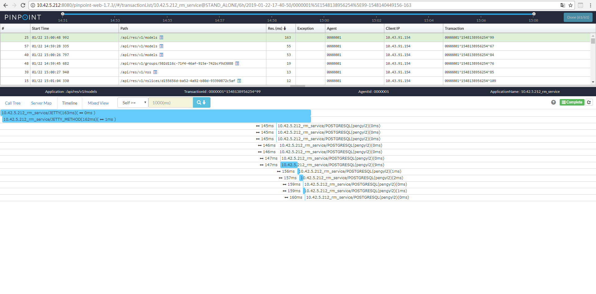

# 初探PinPoint

## 安装JDK
配置JAVA环境变量
    
    export JAVA_HOME=xxxxxxxxx

## 安装HBase
下载HBase

    https://hbase.apache.org/downloads.html

在环境中解压

    tar -xzvf hbase-2.0.4-bin.tar.gz

修改hbase-env.sh
    
    使用Hbase自带的zookeeper，如使用外置zookeeper需置为false
    export HBASE_MANAGES_ZK=true

修改hbase-site.xml

    <property>
        <name>zookeeper.znode.parent</name>
        <value>/hbase</value>
    </property>

启动Hbase

    ./start-hbase.sh

## 执行PinPoint的HBase脚本

克隆pinpoint项目

    https://github.com/naver/pinpoint.git

找到HBase的脚本:pinpoint/hbase/scripts/hbase-create.hbase，执行

    [root@host-192-168-1-110 bin]# ./hbase shell hbase-create.hbase
    2019-01-21 17:30:05,739 WARN  [main] util.NativeCodeLoader: Unable to load nativ                                                                                                                                                             e-hadoop library for your platform... using builtin-java classes where applicabl                                                                                                                                                             e
    Created table AgentInfo
    Took 1.2829 seconds
    Created table AgentStatV2
    Took 2.2695 seconds
    Created table ApplicationStatAggre
    Took 2.2690 seconds
    Created table ApplicationIndex
    Took 0.7182 seconds
    Created table AgentLifeCycle
    Took 0.7425 seconds
    Created table AgentEvent
    Took 0.7177 seconds
    Created table StringMetaData
    Took 0.7207 seconds
    Created table ApiMetaData
    Took 0.7213 seconds
    Created table SqlMetaData_Ver2
    Took 0.7199 seconds
    Created table TraceV2
    Took 4.2861 seconds
    Created table ApplicationTraceIndex
    Took 0.7181 seconds
    Created table ApplicationMapStatisticsCaller_Ver2
    Took 0.7183 seconds
    Created table ApplicationMapStatisticsCallee_Ver2
    Took 0.7191 seconds
    Created table ApplicationMapStatisticsSelf_Ver2
    Took 0.7312 seconds
    Created table HostApplicationMap_Ver2
    Took 0.7218 seconds
    TABLE
    AgentEvent
    AgentInfo
    AgentLifeCycle
    AgentStatV2
    ApiMetaData
    ApplicationIndex
    ApplicationMapStatisticsCallee_Ver2
    ApplicationMapStatisticsCaller_Ver2
    ApplicationMapStatisticsSelf_Ver2
    ApplicationStatAggre
    ApplicationTraceIndex
    HostApplicationMap_Ver2
    SqlMetaData_Ver2
    StringMetaData
    TraceV2
    15 row(s)
    Took 0.0427 seconds

## 安装tomcat

下载tomcat

    https://tomcat.apache.org/download-80.cgi

在环境中解压

    tar -xzvf apache-tomcat-8.5.37.tar.gz

下载pinpoint-collect、pinpoint-web

    https://github.com/naver/pinpoint/releases/tag/1.7.3

将war包放到tomcat的webapp目录

启动tomcat

    cd apache-tomcat-8.5.31/bin
    ./startup.sh

访问pinpoint-web，注意pinpoint-web-1.7.3是war包名，即应用名

    http://10.42.5.212:8080/pinpoint-web-1.7.3//#/main

## 安装应用

部署了本地rm-service应用，配置好连接的pgdb、pgcache、kafka、redis，在此不赘述

## 安装探针

下载pinpoint-agent

    https://github.com/naver/pinpoint/releases/tag/1.7.3

在环境中解压，注意这个tar.gz有点坑，没有二级目录，建议在一个目录下解压

    cd pinpoint-agent/
    tar -xzvf pinpoint-agent-1.7.3.tar.gz

在应用的启动脚本中安装探针，agentId对应一个探针，一个JVM，applicationName对应一个应用。分布式或者微服务环境可以一个应用多个agent，只要agentId不重复即可采集到数据

    JAVA_GLOBAL_OPTS="$JAVA_GLOBAL_OPTS -Dpinpoint.agentId=0000001	"
    JAVA_GLOBAL_OPTS="$JAVA_GLOBAL_OPTS -Dpinpoint.applicationName=10.42.5.212_rm_service"
    JAVA_GLOBAL_OPTS="$JAVA_GLOBAL_OPTS -javaagent:/root/pinpoint-agent/pinpoint-bootstrap-1.7.3.jar	"
    echo "apm_pinpoint open"

## 初步使用

选择一个应用，如下图

使用性能工具压测应用

在Reponse Time Scatter Chart中框选

在新打开的页面就可以看到框选时间段的请求，点击每个请求

Call Tree，如下图

Server Map，如下图

Timeline，如下图

